# Sistem Manajemen Bengkel

Program CLI untuk mengelola beberapa bengkel, pegawai, kendaraan, inspeksi, dan
perbaikan. Implementasi tersedia dalam C++, Python, dan Java dengan struktur
class yang mengikuti ERD.

## Janji

|  |
|:--|
|  |
|  |
|  |
|  |

## Desain diagram program

Diagram sumber yang dapat dibuka dan diedit tersedia di
[desain.drawio](./desain.drawio). Diagram class berikut merangkum relasi dan
struktur utama program:

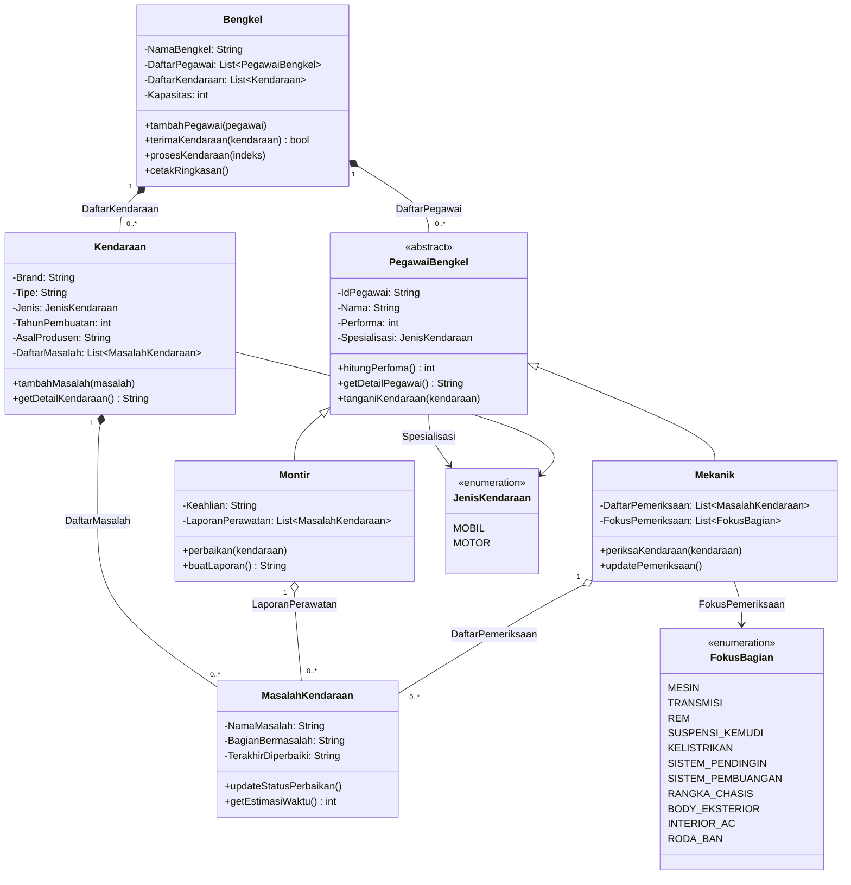

## Atribut dan method setiap class

Nama method pada tabel menggunakan nama API domain yang sama pada ketiga
bahasa. Source bahasa tertentu dapat memiliki helper CLI tambahan yang
dijelaskan pada bagian [Alur program](#alur-program).

### `Bengkel`

| Atribut | Keterangan |
|---|---|
| `NamaBengkel` | Nama bengkel yang ditampilkan pada menu dan ringkasan. |
| `DaftarPegawai` | Daftar pegawai dasar; isinya dapat berupa `Montir` atau `Mekanik`. |
| `DaftarKendaraan` | Kendaraan yang diterima bengkel. |
| `Kapasitas` | Jumlah kendaraan maksimum yang dapat diterima. |

| Method | Keterangan |
|---|---|
| `Bengkel(nama, kapasitas)` | Membuat bengkel kosong dengan batas penerimaan kendaraan. |
| `getNamaBengkel()` | Mengambil nama bengkel. |
| `tambahPegawai(pegawai)` | Mendaftarkan pegawai. |
| `terimaKendaraan(kendaraan)` | Menerima kendaraan jika kapasitas masih tersedia; mengembalikan status berhasil. |
| `kapasitasPenuh()` | Memeriksa apakah kapasitas kendaraan sudah tercapai. |
| `prosesKendaraan(indeksKendaraan)` | Meminta semua pegawai menangani kendaraan terpilih melalui dispatch polimorfik. |
| `getDaftarPegawai()` | Mengambil daftar pegawai bengkel. |
| `getDaftarKendaraan()` | Mengambil daftar kendaraan bengkel. |
| `cetakRingkasan()` | Menampilkan kapasitas, detail pegawai, kendaraan, serta status masalah. |

### `PegawaiBengkel`

Class abstrak yang menyimpan data dan perilaku bersama pegawai.

| Atribut | Keterangan |
|---|---|
| `IdPegawai` | Identitas pegawai. |
| `Nama` | Nama pegawai. |
| `Performa` | Performa dasar dalam bulan. |
| `Spesialisasi` | Jenis kendaraan yang dapat ditangani (`MOBIL` atau `MOTOR`). |

| Method | Keterangan |
|---|---|
| `PegawaiBengkel(id, nama, performa, spesialisasi)` | Menginisialisasi data yang digunakan semua jenis pegawai. |
| `getIdPegawai()`, `getNama()`, `getPerforma()`, `getSpesialisasi()` | Mengambil atribut dasar pegawai. |
| `hitungPerfoma()` | Mengambil performa dasar; implementasi turunan menambahkan kontribusi kerja. |
| `getDetailPegawai()` | Menyusun informasi pegawai untuk ringkasan. |
| `tanganiKendaraan(kendaraan)` | Kontrak abstrak untuk penanganan polimorfik di class turunan. |

### `Montir`

| Atribut | Keterangan |
|---|---|
| `Keahlian` | Deskripsi keahlian teknis Montir. |
| `LaporanPerawatan` | Salinan masalah yang berhasil diperbaiki beserta waktu penyelesaiannya. |

| Method | Keterangan |
|---|---|
| `Montir(id, nama, performa, spesialisasi, keahlian)` | Membuat Montir beserta daftar laporan kosong. |
| `perbaikan(kendaraan)` | Memperbaiki masalah yang belum selesai jika jenis kendaraan cocok dengan spesialisasi. |
| `buatLaporan()` | Menyusun laporan teks dari riwayat perbaikan. |
| `hitungPerfoma()` | Menghitung performa dasar ditambah dua poin per perbaikan. |
| `getDetailPegawai()` | Menampilkan detail dasar, keahlian, dan jumlah laporan. |
| `tanganiKendaraan(kendaraan)` | Mengarahkan dispatch pegawai ke proses perbaikan. |

### `Mekanik`

| Atribut | Keterangan |
|---|---|
| `DaftarPemeriksaan` | Salinan masalah yang dicatat ketika inspeksi. |
| `FokusPemeriksaan` | Bagian yang diperiksa; daftar kosong berarti memeriksa semua bagian. |

| Method | Keterangan |
|---|---|
| `Mekanik(id, nama, performa, spesialisasi, fokus)` | Membuat Mekanik dengan daftar fokus pemeriksaan. |
| `sesuaiFokus(masalah)` | Memeriksa apakah bagian suatu masalah termasuk dalam fokus Mekanik. |
| `periksaKendaraan(kendaraan)` | Memeriksa kendaraan yang sesuai spesialisasi dan mencatat masalah sesuai fokus. |
| `updatePemeriksaan()` | Mengurutkan temuan berdasarkan estimasi waktu terlama terlebih dahulu. |
| `getDaftarPemeriksaan()` | Mengambil daftar temuan inspeksi. |
| `hitungPerfoma()` | Menghitung performa dasar ditambah satu poin per temuan. |
| `getDetailPegawai()` | Menampilkan detail dasar, fokus, dan jumlah temuan. |
| `tanganiKendaraan(kendaraan)` | Mengarahkan dispatch pegawai ke proses pemeriksaan. |

### `Kendaraan`

| Atribut | Keterangan |
|---|---|
| `Brand` | Merek kendaraan. |
| `Tipe` | Model atau tipe kendaraan. |
| `Jenis` / `JenisKendaraan` | Kategori kendaraan dalam enum `JenisKendaraan`. |
| `TahunPembuatan` | Tahun kendaraan dibuat. |
| `AsalProdusen` | Negara asal produsen. |
| `DaftarMasalah` | Daftar objek `MasalahKendaraan` yang dimiliki kendaraan. |

| Method | Keterangan |
|---|---|
| `Kendaraan(brand, tipe, jenis, tahun, asal)` | Membuat kendaraan dengan daftar masalah kosong. |
| `getJenis()` | Mengambil kategori kendaraan untuk validasi spesialisasi. |
| `getDaftarMasalah()` | Mengambil masalah kendaraan. |
| `tambahMasalah(masalah)` | Menambahkan masalah pada kendaraan. |
| `getDetailKendaraan()` | Menyusun identitas kendaraan dan jumlah masalah. |

### `MasalahKendaraan`

| Atribut | Keterangan |
|---|---|
| `NamaMasalah` | Deskripsi masalah. |
| `BagianBermasalah` | Nama bagian yang bermasalah, diselaraskan dengan nilai `FokusBagian`. |
| `TerakhirDiperbaiki` | Waktu lokal perbaikan terakhir; `"-"` berarti belum diperbaiki. |

| Method | Keterangan |
|---|---|
| `MasalahKendaraan(nama, bagian)` | Membuat masalah baru dengan status belum diperbaiki. Java juga menyediakan konstruktor salin untuk menyimpan snapshot. |
| `getNamaMasalah()`, `getBagianBermasalah()`, `getTerakhirDiperbaiki()` | Mengambil deskripsi, bagian, dan waktu perbaikan. |
| `sudahDiperbaiki()` | Memeriksa apakah perbaikan sudah tercatat. |
| `updateStatusPerbaikan()` | Mencatat waktu saat perbaikan dinyatakan selesai. |
| `getEstimasiWaktu()` | Mengambil estimasi perbaikan dalam jam berdasarkan bagian. |

### Enumerasi

| Enum | Nilai | Penggunaan |
|---|---|---|
| `JenisKendaraan` | `MOBIL`, `MOTOR` | Jenis kendaraan dan spesialisasi pegawai. |
| `FokusBagian` | `MESIN`, `TRANSMISI`, `REM`, `SUSPENSI_KEMUDI`, `KELISTRIKAN`, `SISTEM_PENDINGIN`, `SISTEM_PEMBUANGAN`, `RANGKA_CHASIS`, `BODY_EKSTERIOR`, `INTERIOR_AC`, `RODA_BAN` | Fokus inspeksi Mekanik dan pilihan bagian masalah pada CLI. |

Fungsi `toString()` pada C++ dan `to_string()` pada Python mengubah nilai enum
menjadi label teks untuk tampilan dan pencocokan bagian masalah. Java memakai
representasi nama enum secara langsung.

### Entry point dan helper CLI

| Implementasi | State dan method/fungsi aplikasi |
|---|---|
| C++ — `main.cpp` | `main()` menjalankan menu; `daftarFokus()` menyediakan pilihan enum; `bacaTeks()` dan `bacaAngka()` memvalidasi input; `bacaJenisKendaraan()` dan `bacaFokus()` mengonversi pilihan ke enum; `tambahPegawai()`, `tambahKendaraan()`, dan `prosesKendaraan()` menjalankan operasi pada bengkel aktif; `tambahBengkel()` dan `gantiBengkel()` mengelola bengkel; `tampilkanLaporanMontir()` menampilkan laporan; `isiDataAwal()` memuat data contoh. |
| Java — `Main` | Memiliki `INPUT` sebagai `Scanner` standar. Method statis mencakup `bacaTeks()`, `bacaAngka()`, `bacaJenisKendaraan()`, `bacaFokus()`, `tambahPegawai()`, `tambahKendaraan()`, `prosesKendaraan()`, `tambahBengkel()`, `gantiBengkel()`, `tampilkanLaporanMontir()`, `isiDataAwal()`, dan `main()`. |
| Python — `main.py` | Tidak memakai class CLI terpisah. Fungsi modul menyediakan input tervalidasi (`baca_teks()`, `baca_angka()`), pilihan enum, tambah/proses pegawai dan kendaraan, tambah/ganti bengkel, laporan Montir, pemuatan data awal, dan `main()` sebagai loop menu. |

## Penjelasan desain program

### Inheritance dan polimorfisme

- `Montir` dan `Mekanik` mewarisi `PegawaiBengkel`.
- `PegawaiBengkel` menjadi kontrak abstrak untuk data pegawai dan operasi
  `tanganiKendaraan`.
- `Bengkel` menyimpan pegawai melalui tipe dasar `PegawaiBengkel`. Saat
  `prosesKendaraan()` dipanggil, dispatch polimorfik menjalankan perbaikan
  Montir atau pemeriksaan Mekanik.
- Kedua turunan memvalidasi `Spesialisasi` terhadap jenis kendaraan. Mekanik
  juga menyaring masalah berdasarkan `FokusPemeriksaan`.

### Composition dan relasi kepemilikan

- **Kendaraan–MasalahKendaraan:** komposisi utama pada ERD. Setiap kendaraan
  menyimpan daftar masalahnya sendiri; masalah dibuat untuk kendaraan tersebut
  dan status perbaikannya ikut menjadi bagian dari data kendaraan.
- **Bengkel–Kendaraan dan Bengkel–PegawaiBengkel:** bengkel mengelola daftar
  kendaraan dan pegawai. Implementasi C++ menyimpan kendaraan berdasarkan
  nilai dan pegawai dengan `unique_ptr`; Python dan Java menyimpan referensi
  objek pada daftar bengkel. Data operasional tersebut dikelola per bengkel.
- **LaporanPerawatan dan DaftarPemeriksaan:** Montir dan Mekanik menyimpan
  salinan masalah sebagai catatan hasil kerja/inspeksi. Salinan ini merekam
  keadaan saat pekerjaan berlangsung; ia bukan objek masalah yang sama pada
  kendaraan.
- `JenisKendaraan` dan `FokusBagian` adalah enumerasi, bukan class turunan.
  `BagianBermasalah` disimpan sebagai teks nama bagian agar sesuai dengan ERD,
  sementara pilihan CLI dan fokus Mekanik menggunakan enum.

## Alur program

Alur berikut berlaku untuk C++, Python, dan Java:

1. Program membuat `Bengkel Maju Jaya` dan memuat data contoh pegawai serta
   Toyota Avanza. Data tidak dicetak atau diproses otomatis saat startup.
2. Menu CLI menerima pilihan pengguna. Input teks wajib dan angka divalidasi
   sebelum data didaftarkan.
3. Pengguna dapat menambah Montir/Mekanik atau kendaraan beserta masalahnya.
   Penerimaan kendaraan memeriksa kapasitas bengkel.
4. Pengguna dapat meminta ringkasan, memilih kendaraan untuk diproses, atau
   menampilkan laporan Montir.
5. Saat kendaraan diproses, semua pegawai bengkel menangani objek yang sama
   melalui method polimorfik; pekerjaan yang dilakukan bergantung pada
   spesialisasi dan fokus pegawai.
6. Pengguna dapat membuat bengkel baru atau berpindah bengkel. Data setiap
   bengkel terpisah dan tersedia selama sesi program berlangsung.
7. Pilihan `0` atau akhir input menghentikan sesi.

### Menjalankan program

Jalankan perintah dari direktori root repository.

**C++**

```powershell
New-Item -ItemType Directory -Force .\out | Out-Null
g++ -std=c++14 -Wall -Wextra -pedantic .\CPP\code\main.cpp -o .\out\workshop-cpp.exe
.\out\workshop-cpp.exe
```

**Python**

```powershell
python .\Python\code\main.py
```

Atau jalankan sebagai package:

```powershell
python -m Python.code
```

**Java**

```powershell
New-Item -ItemType Directory -Force .\out\java | Out-Null
javac --release 11 -d .\out\java .\Java\code\*.java
java -cp .\out\java Main
```

## Dokumentasi visual

Screenshot yang sudah tersedia di repository ditampilkan per bahasa.

### C++

| Fitur | Screenshot |
|---|---|
| Menu dan ringkasan | 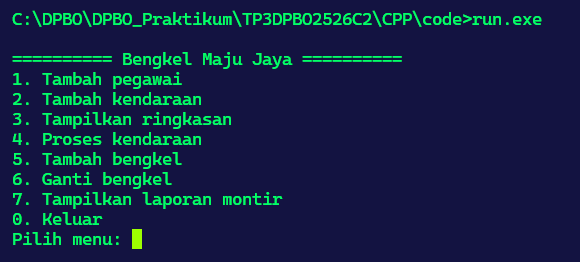 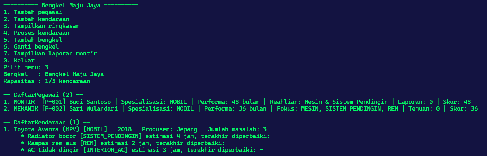 |
| Tambah pegawai | 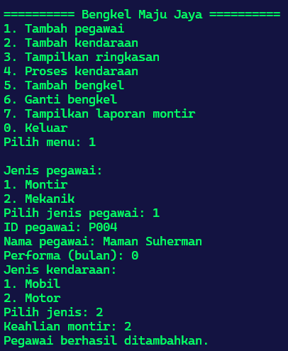 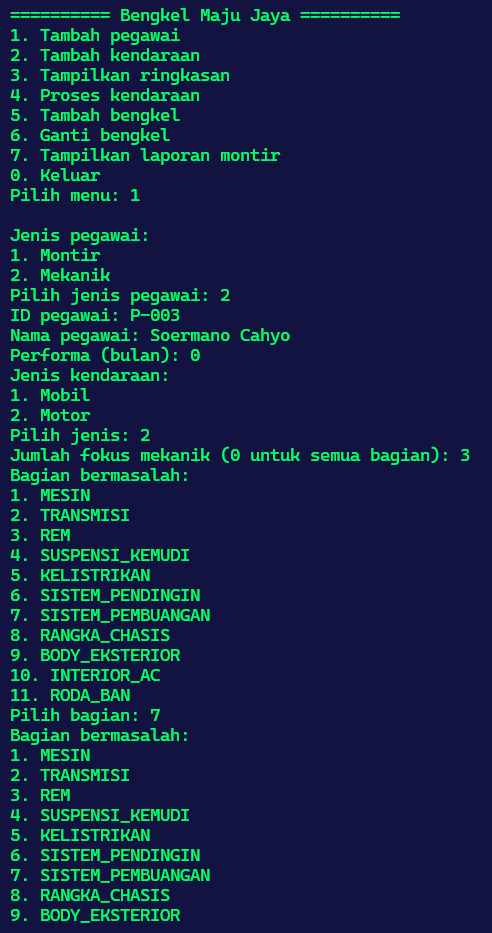 |
| Tambah kendaraan dan proses | 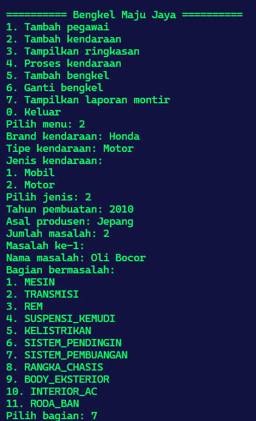 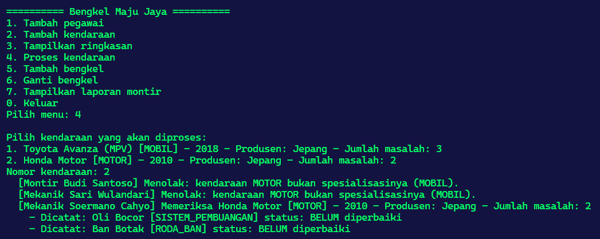 |
| Laporan dan bengkel | 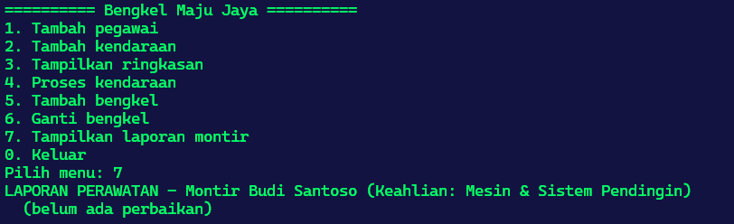 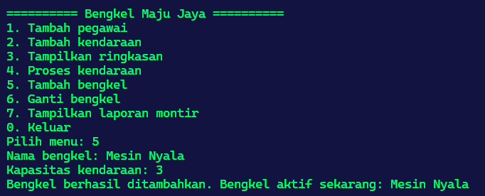 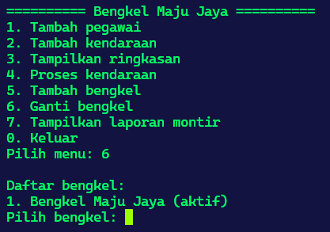 |

### Python

| Fitur | Screenshot |
|---|---|
| Menu dan ringkasan | 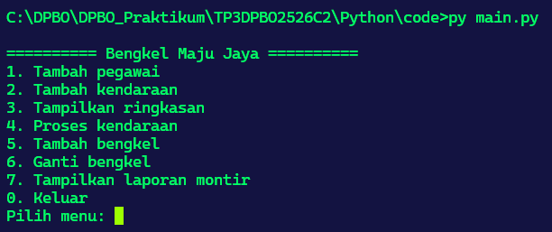 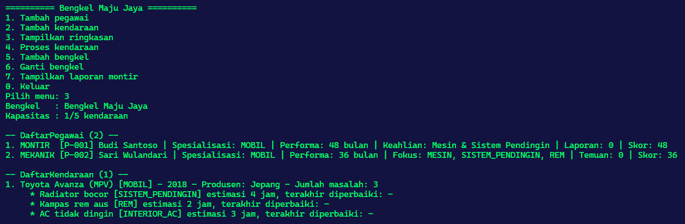 |
| Tambah pegawai | 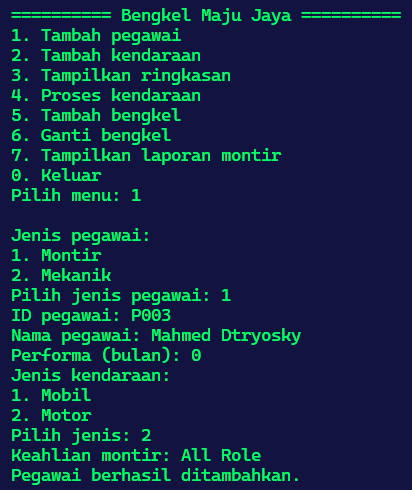 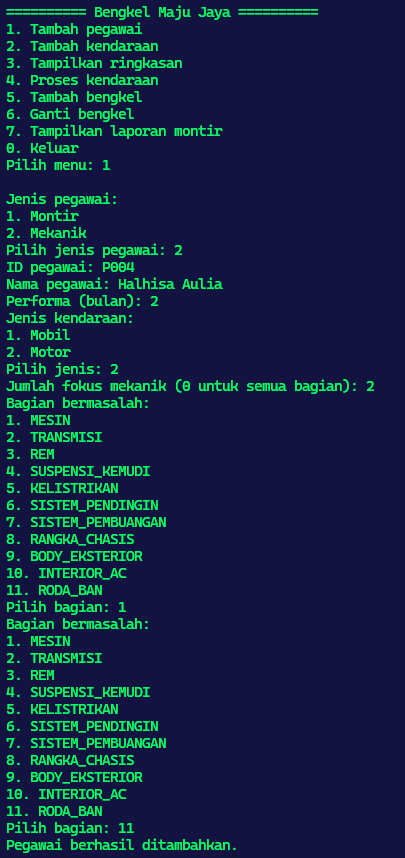 |
| Tambah kendaraan dan proses | 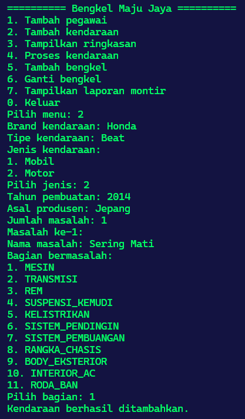 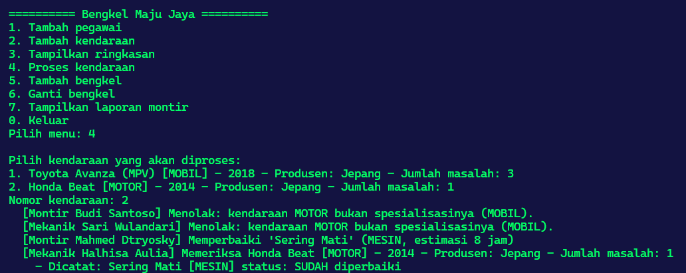 |
| Laporan dan bengkel | 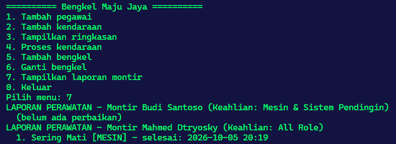 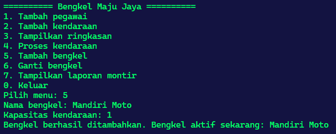 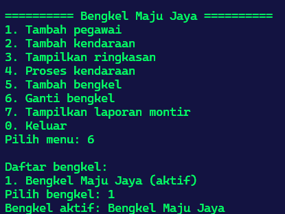 |

### Java

| Fitur | Screenshot |
|---|---|
| Menu dan ringkasan | 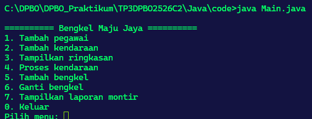 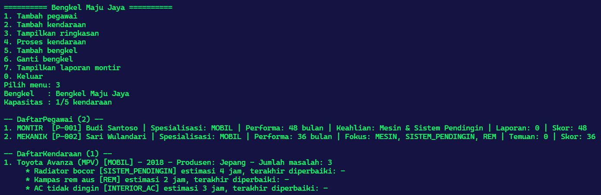 |
| Tambah pegawai | 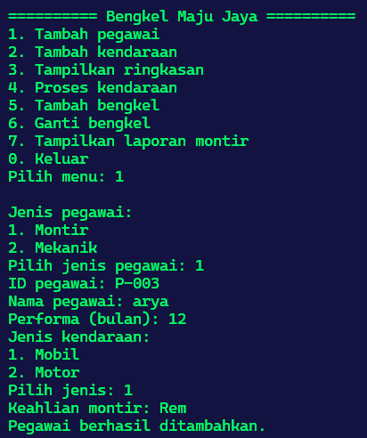 |
| Tambah kendaraan dan proses | 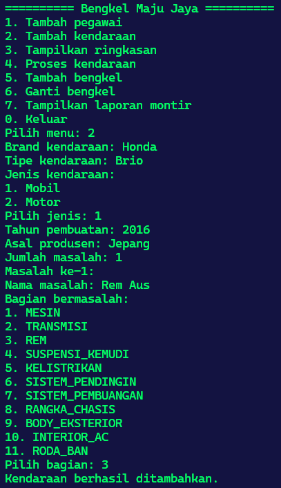 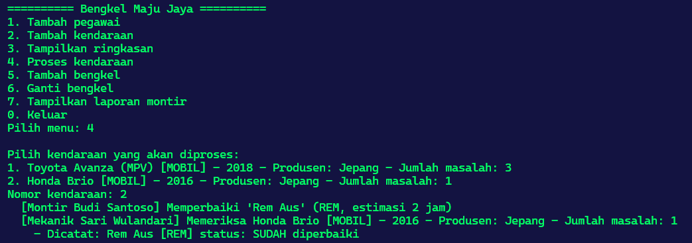 |
| Laporan dan bengkel | 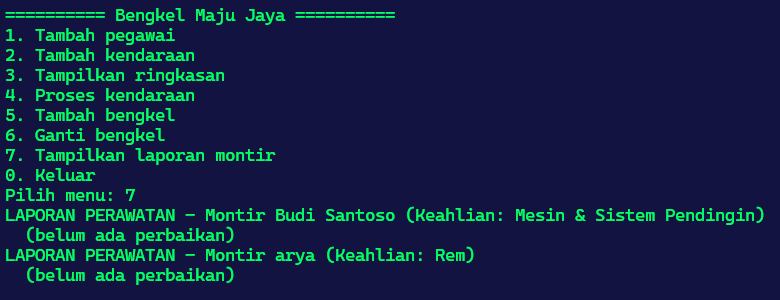 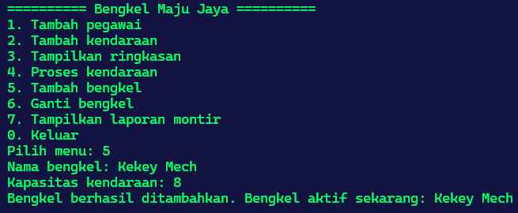 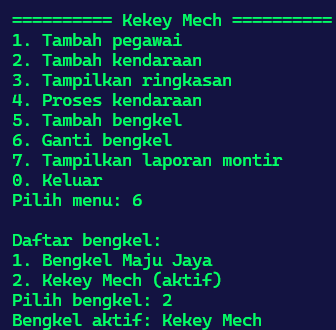 |
